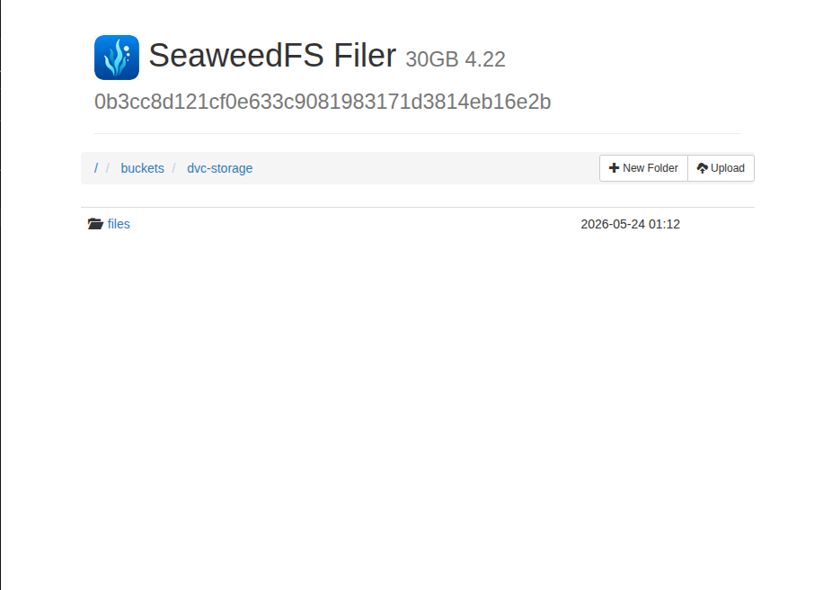

# Day 12: Configure a DVC Remote Storage
The xFusionCorp Industries ML team uses SeaweedFS as the shared S3-compatible object store for DVC-tracked data. A .dvc/config already declares a remote called s3 for the fraud-detection project, but dvc push currently fails. Correct the configuration and push the tracked data into the SeaweedFS bucket.


A project exists at /root/code/fraud-detection/ with DVC initialised and data/raw/transactions.csv already tracked.

SeaweedFS is already running on the controlplane:

S3 endpoint: http://localhost:8333
Filer UI: open the SeaweedFS Filer button at the top of the lab (forwarded port 8888) – buckets are visible under /buckets/.
Credentials: weedadmin / weedadmin123 (already set in .dvc/config)
Bucket name: dvc-storage (already created and visible in the Filer UI under /buckets/dvc-storage)
Review the existing .dvc/config and correct everything that prevents dvc push from succeeding. The remote called s3 must:

point at the dvc-storage bucket using s3://;
use the correct SeaweedFS S3 endpoint URL;
be marked as the default remote.
Push the tracked data. After the push, the dvc-storage bucket in the SeaweedFS Filer UI must contain at least one object under the files/md5/... prefix.


---

## Solution
---
### 1. Expand the fraud-detection folder and open the .dvc/config file
- The config file looks like:
```bash
['remote "s3"']
    url = s3://buckets/
    endpointurl = http://localhost:9999
    access_key_id = weedadmin
    secret_access_key = weedadmin123

```

- Modify the url and the endpointurl:

```bash
['remote "s3"']
    url = s3://dvc-storage
    endpointurl = http://localhost:8333
    access_key_id = weedadmin
    secret_access_key = weedadmin123
```
- Mark it as the default remote
```bash
dvc remote default s3
```

- Push the tracked data then check the SeaweedFS by clicking the icon at the top of the page to check if files have been pushed to the S3 bucket.

```bash
dvc push
```

##### When you open Filer UI at the top of the page and then open the dvc-storage folder in thr buckets , you will find the pushed files



